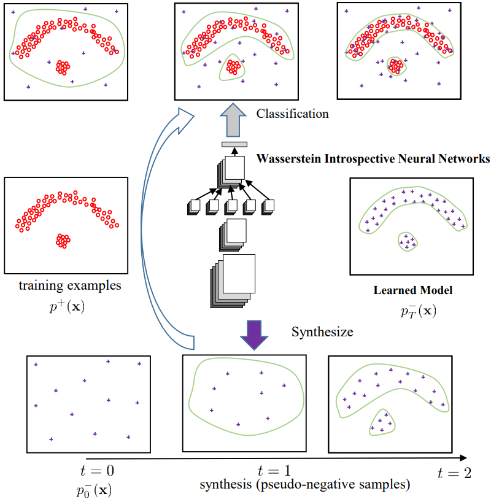

# Wasserstein-Introspective-Neural-Networks


This repository contains the code for the paper:
<br>
[**Wasserstein Introspective Neural Networks**](http://arxiv.org/abs/1711.08875)
<br>
Kwonjoon Lee, Weijian Xu, Fan Fan, Zhuowen Tu
<br>
CVPR 2018 (**Oral**)
<p align='center'>
  
</p>

### Introduction

   We present Wasserstein introspective neural networks (WINN) that are both a generator and a discriminator within a single model. WINN provides a significant improvement over the recent introspective neural networks (INN) method by enhancing INN's generative modeling capability. WINN has three interesting properties: (1) A mathematical connection between the formulation of Wasserstein generative adversarial networks (WGAN) and the INN algorithm is made; (2) The explicit adoption of the Wasserstein distance into INN results in a large enhancement to INN, achieving compelling results even with a single classifier --- e.g., providing a 20 times reduction in model size over INN within texture modeling; (3) When applied to supervised classification, WINN also gives rise to greater robustness with an $88\%$ reduction of errors against adversarial examples --- improved over the result of $39\%$ by an INN-family algorithm. In the experiments, we report encouraging results on unsupervised learning problems including texture, face, and object modeling, as well as a supervised classification task against adversarial attack.
   
### Citation

If you use this code for your research, please cite our paper:
```
@inproceedings{lee2018winn,
  title={Wasserstein Introspective Neural Networks},
  author={Lee, Kwonjoon and Xu, Weijian and Fan, Fan and Tu, Zhouwen},
  booktitle={CVPR},
  year={2018}
}
```
